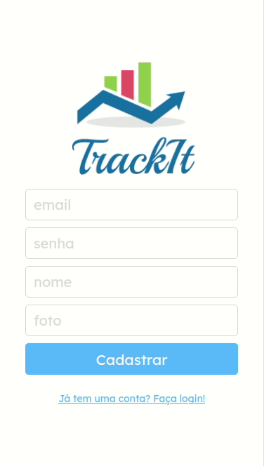
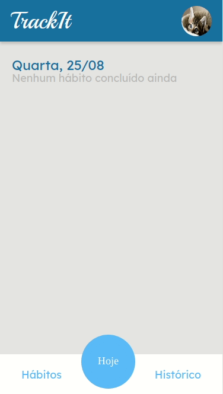

# Track-it

An easy-to-use habits tracker. Create new habits, track your daily habits, check your percentage for each day and delete old habits.
<br/>

<div align="center">
  
  
</div>

<br/>

Try it out now at https://trackit-beta.vercel.app

## About

This is an web application to control your daily habits. It was designed to smaller screens (such as cellphones) but it works fine on bigger screens as well. Below are the implemented features:

- Sign Up
- Login
- Create a new habit
- Choose in which days this habit should be done
- Delete a habit
- Check/uncheck an daily habit
- See your sequence and your record for each habit

<p>
    The motivation for this project was the urge to keep track of my habits without needing to worry about them myself. This way, I could be more productive in other areas of my life.
    In the future, I would like to add a dark theme, multi-language settings and a history page containing your deleted habits.
</p>

## Technologies
The following tools and frameworks were used in the construction of the project:<br>
<p>
  
  
  
  
  
</p>

## How to run

1. Clone this repository
```bash
git clone https://github.com/Celusgo/track-it
```
2. Install dependencies
```bash
npm i
```
3. Run the front-end with
```bash
npm start
```
4. You can optionally build the project running
```bash
npm run build
```
5. Finally access http://localhost:3000 on your favorite browser